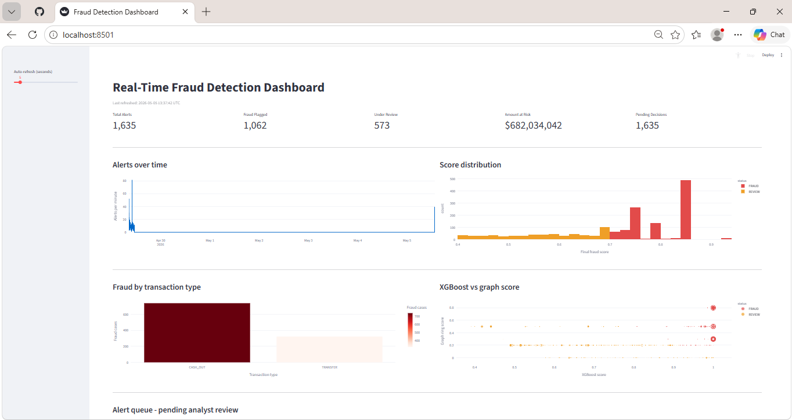
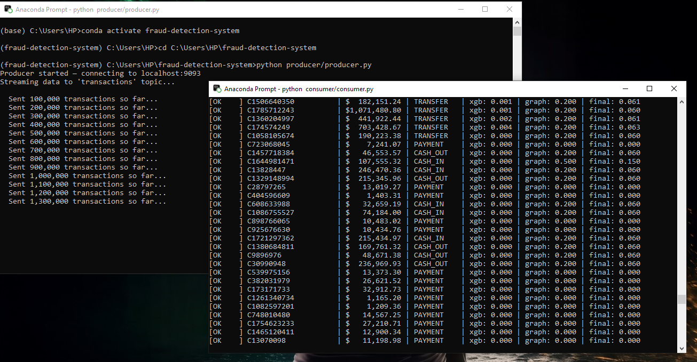
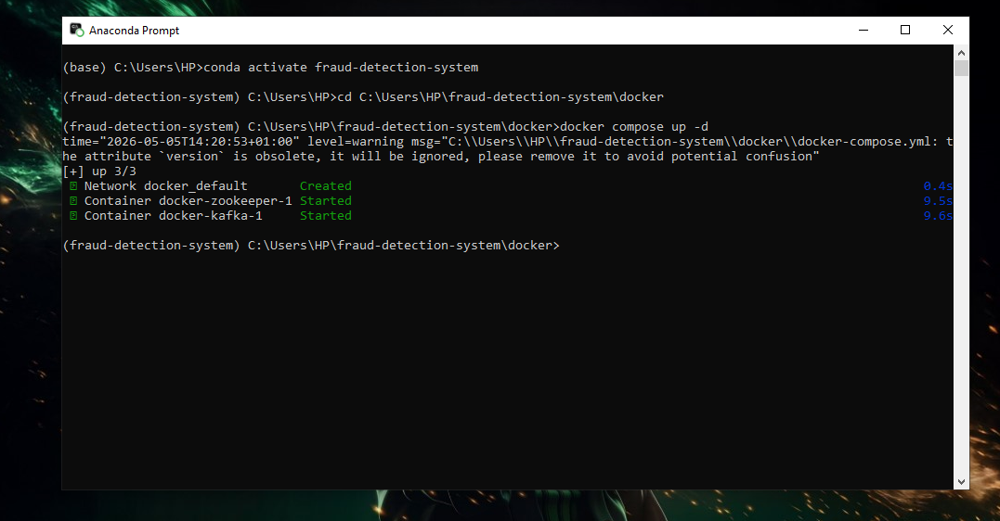
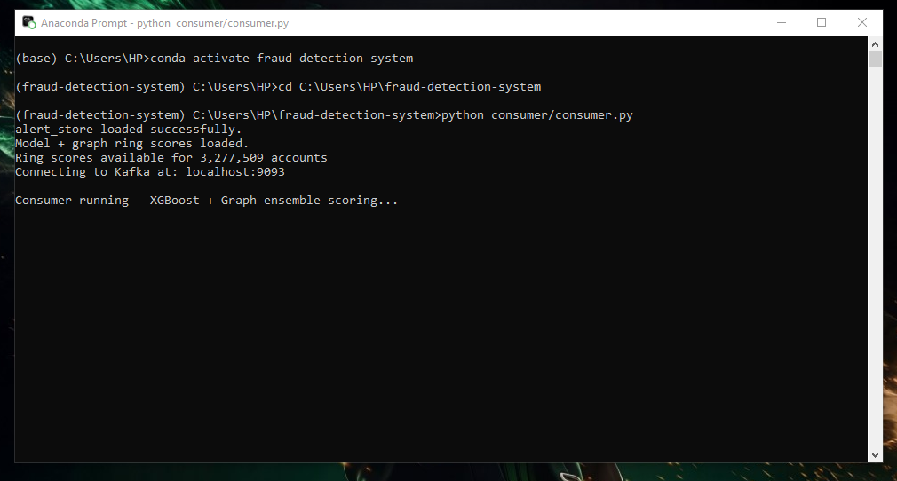
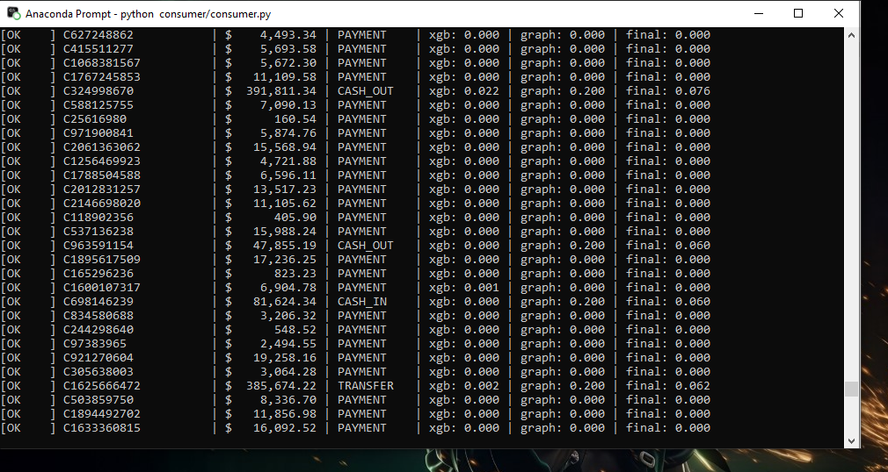
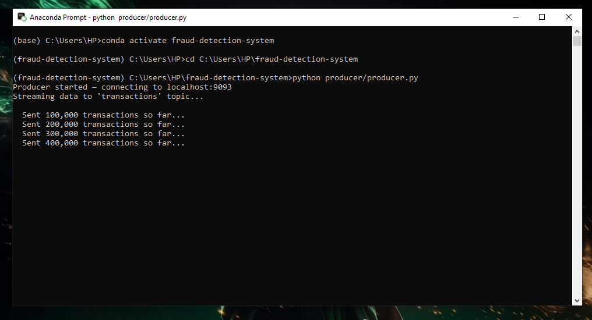
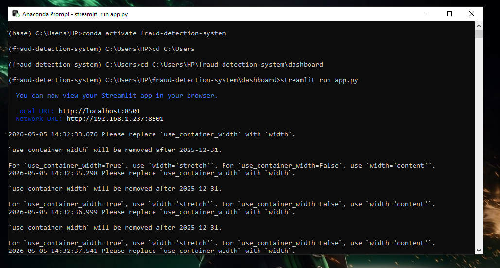
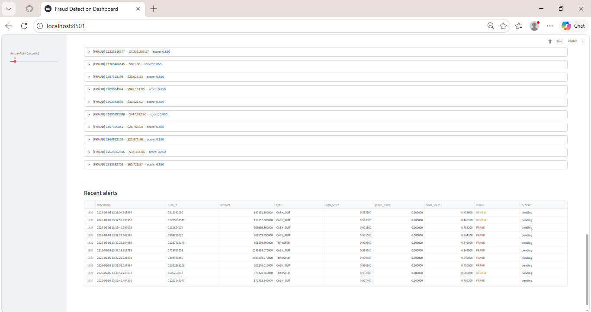

  

  


## Table of Contents
  
- [Business Problem](#BusinessProblem)
- [ProjectOverview](#ProjectOverview)
- [Architecture](#Architecture)
- [Methodology](#Methodology)
- [Tools](#Tools)
- [ExceutionOrder](#ExceutionOrder)
- [Challenge&Solution](#Challenges&Solution)


## Project Overview


***Business Problem***
- Financial institutions process millions of transactions daily. Manually reviewing all of them is impossible. This system automatically scores every transaction in real time,
flags suspicious activity, and presents it to an analyst for a final decision to reduce fraud losses, while minimising false alarms that frustrate legitimate customers.


***Objective (Goal)***
- This project creates a real-time, production-grade fraud detection system from scratch that includes explainability, data streaming, machine learning, graph analysis, and a live analyst dashboard. 


***Results***

| Model | Results | Meaning |
| --- | --- | --- |
| Processed transactions (CSV) | 6,362,620 |
| ROC-AUC | 0.9999 |
| PR-AUC | 0.9834 |
| Fraud precision rate | 89% |
| Fraud recall rate | 95% |
| Fraud cases detected | 4,027 |
| Scoring latency | <50ms |


## Architecture


```
CSV ▶ Producer ▶ Kafka Producer ▶ Consumer ▶ ALERTS.JSON ▶ Streamlit Dashboard


```


## Tools

| Tools | Purpose |
| --- | --- | 
| Apache-Kafka | Data process pipeline | 
| Docker | Stream live data (docker containers) |
| Python (Pandas, Numpy, XGBoost, SHAP, Joblib, Scikit-Learn) | Data cleaning, feature engineering, train model |
| Streamlit | In place of Power-BI for dahsboard | 

## Methodology 

**Pipeline & Kafka streaming (Step 1):**

I built a real time data streaming pipeline using **Apache Kafka** that runs inside a docker container. The pipeline reads 6m+ transactions from a CSV file and streams them as live JSON events. It imitates a real babnk transaction feeds. The data is also being sent in batches (100,000 rows).

***Why it Matters*** 
- Read and Batch data streaming process.
- Integrate kafka with docker containers.

**XG-Boost classifier & SHAP (Step 2):**

This part a machine learning model was built that scores every transaction (0-1) incase of fraud probability. This model is trained on 5m historical transactions and validated on 1.27m. SHAP is added to tell the reason why a transaction was flagged. 

***Why it Matters***
  - Feature Engineering (Training model for a ML output to undertsand): Raw transactions columns are not enough for a model to learn from, so a new feature was engineered to capture fraud anomalies.
  - XG Boost is industry standard for fraud data cases because it handles class imbalance, and also easy to train on millions of rows.
  - SHAP explains why a specific transaction is flagged. It shows then features that pushes the score up and by how much.

**Graph & ML ring detection (Step 3):**

Developed a graph based fraud detection (TRANSFER and CASH_OUT transactions only types where fraud occurs) layer that analyses the relationship between accounts and not just individual transactions. It build networks where accounts are node and transactions are edges.

***Why it Matters***
- Ring score - every accounts receives a ring score between 0 and 1 on its graph properties. This rules are interpretable so analyst can understand and challenge any score.
- Ensemble scoring to make decisions - the final fraud score cobines model with weighted average. XG Boost carries the 70% of the weight and the graph score carries 30.


**Streamlit Dashboard & Alert Queue (Step 4)**

A live dashboard built with streamlit that opens automatically on my browser. It refreshes every 5 secods, show charts and an alerts queue where analyst can review flagged transactions and note down decisions.

***Why Streamlit?***
- Streamlit converts python script directly into web development application without no front end required.


## Execution Process

 
**Kafka + Docker container starting**




**Consumer running**







**Producer running** 



**Dashboard running**







## Challenges & Solution

**Challenge**
- The data pipeline processing performance was terrible and I noticed it takes 7-8 hrs to send 280,000 data, with that math, It's certain to achieve the full sending of 6m+ rows data will take 7-8 days maiking the project goal impossible.

**Solution**
- Instead of sending data rows by rows, I did a batch processing.
- Made changes to the chunk size to balance memory usage.
- Lastly, I noticed the timer is also contributing to this so i reduced it from 0.1 seconds to 0.001 seconds.

**Result**
- What was predicted to take 7-8 days before data fully sent now takes less than 1hr. 95% improvement.
- Increased in data transmission of 35k rows per hour to 50k rows per minutes. 85% transmission speed.
- Real time fraud detection was successfully enabled.
