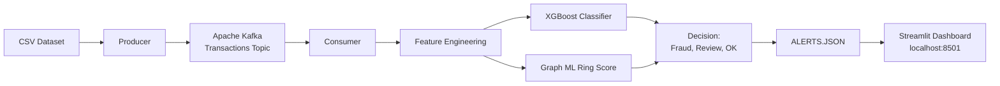
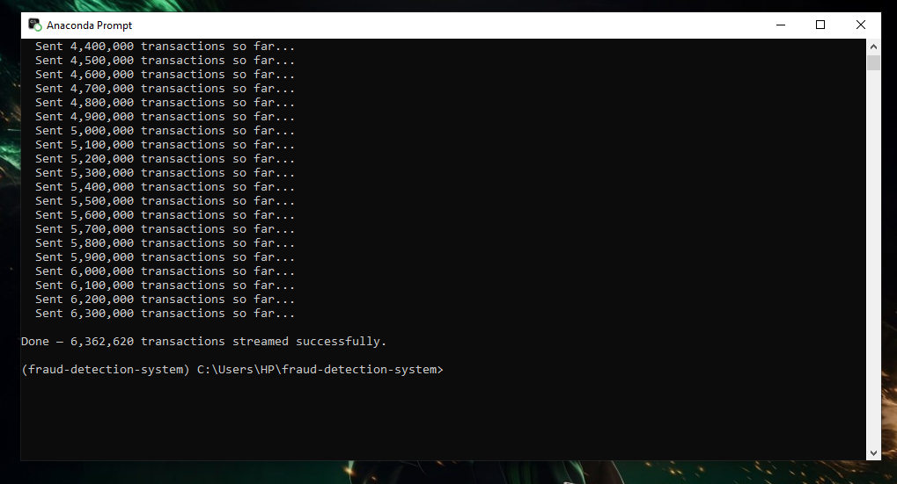

## Table of Contents
  
- [Business Problem](#BusinessProblem)
- [ProjectOverview](#ProjectOverview)
- [Architecture](#Architecture)
- [Methodology](#Methodology)
- [Tools](#Tools)
- [ExceutionOrder](#ExceutionOrder)
- [Challenge&Solution](#Challenges&Solution)


## Project Overview


***Business Problem***
- Financial institutions process millions of transactions daily. Manually reviewing all of them is impossible. This system automatically scores every transaction in real time,
flags suspicious activity, and presents it to an analyst for a final decision to reduce fraud losses, while minimising false alarms that frustrate legitimate customers.


***Objective (Goal)***
- This project creates a real-time, production-grade fraud detection system from scratch that includes explainability, data streaming, machine learning, graph analysis, and a live analyst dashboard. [Watch Demo-Video](https://screenrec.com/share/vaIqtEyWsC)


***Results***

| Model | Results | Meaning |
| --- | --- | --- |
| Processed transactions (CSV) | 6,362,620 |
| ROC-AUC | 0.9999 |
| PR-AUC | 0.9834 |
| Fraud precision rate | 89% |
| Fraud recall rate | 95% |
| Fraud cases detected | 4,027 |
| Scoring latency | <50ms |


## Architecture

This project is built on three functional layers that works together as a continous pipeline (Ingestion, Detection and Response). 

```
- Ingestion: Its purpose is to stream raw CSV transactions in realtime.
- Detection: Its purpose is to score each and every transaction based on fraud probabilites.
- Response: Purpose is to act on the score.

```


## Methodology 

**Pipeline & Kafka streaming (Step 1):**

I built a real time data streaming pipeline using **Apache Kafka** that runs inside a docker container. The pipeline reads 6m+ transactions from a CSV file and streams them as live JSON events. It imitates a real babnk transaction feeds. The data is also being sent in batches (100,000 rows).

***Why it Matters*** 
- Read and Batch data streaming process.
- Integrate kafka with docker containers.

**XG-Boost classifier & SHAP (Step 2):**

This part a machine learning model was built that scores every transaction (0-1) incase of fraud probability. This model is trained on 5m historical transactions and validated on 1.27m. SHAP is added to tell the reason why a transaction was flagged. 

***Why it Matters***
  - Feature Engineering (Training model for a ML output to undertsand): Raw transactions columns are not enough for a model to learn from, so a new feature was engineered to capture fraud anomalies.
  - XG Boost is industry standard for fraud data cases because it handles class imbalance, and also easy to train on millions of rows.
  - SHAP explains why a specific transaction is flagged. It shows then features that pushes the score up and by how much.

**Graph & ML ring detection (Step 3):**

Developed a graph based fraud detection (TRANSFER and CASH_OUT transactions only types where fraud occurs) layer that analyses the relationship between accounts and not just individual transactions. It build networks where accounts are node and transactions are edges.

***Why it Matters***
- Ring score - every accounts receives a ring score between 0 and 1 on its graph properties. This rules are interpretable so analyst can understand and challenge any score.
- Ensemble scoring to make decisions - the final fraud score cobines model with weighted average. XG Boost carries the 70% of the weight and the graph score carries 30.


**Streamlit Dashboard & Alert Queue (Step 4)**

A live dashboard built with streamlit that opens automatically on my browser. It refreshes every 5 secods, show charts and an alerts queue where analyst can review flagged transactions and note down decisions.

***Why Streamlit?***
- Streamlit converts python script directly into web development application without no front end required.


## Execution Process

```yml
version: '3.8'

services:
  zookeeper:
    image: confluentinc/cp-zookeeper:7.4.0
    environment:
      ZOOKEEPER_CLIENT_PORT: 2181
    ports:
      - "2181:2181"

  kafka:
    image: confluentinc/cp-kafka:7.4.0
    depends_on:
      - zookeeper
    ports:
      - "9092:9092"
      - "9093:9093"
    environment:
      KAFKA_BROKER_ID: 1
      KAFKA_ZOOKEEPER_CONNECT: zookeeper:2181
      KAFKA_LISTENERS: PLAINTEXT_INTERNAL://0.0.0.0:9092,PLAINTEXT_EXTERNAL://0.0.0.0:9093
      KAFKA_ADVERTISED_LISTENERS: PLAINTEXT_INTERNAL://kafka:9092,PLAINTEXT_EXTERNAL://localhost:9093
      KAFKA_LISTENER_SECURITY_PROTOCOL_MAP: PLAINTEXT_INTERNAL:PLAINTEXT,PLAINTEXT_EXTERNAL:PLAINTEXT
      KAFKA_INTER_BROKER_LISTENER_NAME: PLAINTEXT_INTERNAL
      KAFKA_OFFSETS_TOPIC_REPLICATION_FACTOR: 1 
```
 
**Kafka + Docker container starting**


**Consumer running**

```python

import json
import os
import sys
import joblib
import numpy as np
import pandas as pd
from kafka import KafkaConsumer

#1: import alert_store from dashboard folder.
DASHBOARD_PATH = 'C:/Users/HP/fraud-detection-system/dashboard'

if DASHBOARD_PATH not in sys.path:
    sys.path.insert(0, DASHBOARD_PATH)

try:
    from alert_store import save_alert
    print("alert_store loaded successfully.")
except ImportError as e:
    print(f"WARNING: Could not load alert_store: {e}")
    print("Alerts will not be saved — check dashboard/alert_store.py exists.")
    # define a dummy so consumer keeps running even if import fails
    def save_alert(*args, **kwargs):
        pass

#2: load model, features, and ring scores 
kafka_servers     = os.getenv('KAFKA_BOOTSTRAP_SERVERS', 'localhost:9093')
model_path        = os.getenv('MODEL_PATH', 'C:/Users/HP/fraud-detection-system/model/fraud_model.pkl')
feature_cols_path = os.getenv('FEATURE_COLS_PATH', 'C:/Users/HP/fraud-detection-system/model/feature_cols.pkl')
ring_scores_path  = os.getenv('RING_SCORES_PATH', 'C:/Users/HP/fraud-detection-system/model/ring_scores.pkl')

model        = joblib.load(model_path)
FEATURE_COLS = joblib.load(feature_cols_path)
ring_scores  = joblib.load(ring_scores_path)

print("Model + graph ring scores loaded.")
print(f"Ring scores available for {len(ring_scores):,} accounts")
print(f"Connecting to Kafka at: {kafka_servers}\n")

#3: connect to kafka
consumer = KafkaConsumer(
    'transactions',
    bootstrap_servers=kafka_servers,
    auto_offset_reset='earliest',
    group_id='fraud-detector-v4',
    value_deserializer=lambda m: json.loads(m.decode('utf-8'))
)

print("Consumer running - XGBoost + Graph ensemble scoring...\n")

#4: feature builder 
type_map = {'CASH_OUT': 0, 'PAYMENT': 1, 'CASH_IN': 2, 'TRANSFER': 3, 'DEBIT': 4}

def build_features(txn):
    old_orig = txn['old_balance_orig']
    new_orig = txn['new_balance_orig']
    old_dest = txn['old_balance_dest']
    new_dest = txn['new_balance_dest']
    amount   = txn['amount']

    return pd.DataFrame([{
        'step'                   : txn['step'],
        'type_encoded'           : type_map.get(txn['transaction_type'], -1),
        'amount'                 : amount,
        'oldbalanceOrg'          : old_orig,
        'newbalanceOrig'         : new_orig,
        'oldbalanceDest'         : old_dest,
        'newbalanceDest'         : new_dest,
        'orig_balance_change'    : new_orig - old_orig,
        'dest_balance_change'    : new_dest - old_dest,
        'orig_drained'           : int(new_orig == 0),
        'amount_to_balance_ratio': amount / old_orig if old_orig > 0 else 0,
        'zero_orig_before'       : int(old_orig == 0),
        'zero_dest_before'       : int(old_dest == 0),
    }])

#5: ensemble scoring loop
for message in consumer:
    txn = message.value

    try:
        features       = build_features(txn)
        xgb_score      = model.predict_proba(features)[0][1]
        sender_ring    = ring_scores.get(txn['user_id'], 0.0)
        recipient_ring = ring_scores.get(txn['recipient_id'], 0.0)
        graph_score    = max(sender_ring, recipient_ring)
        final_score    = (0.7 * xgb_score) + (0.3 * graph_score)

        if final_score > 0.7:
            status = "FRAUD"
        elif final_score > 0.4:
            status = "REVIEW"
        else:
            status = "OK"

        #6: save FRAUD and REVIEW alerts to file for dashboard
        if status in ("FRAUD", "REVIEW"):
            save_alert(txn, xgb_score, graph_score, final_score, status)

        print(
            f"[{status:<6}] "
            f"{txn['user_id']:<20} | "
            f"${txn['amount']:>12,.2f} | "
            f"{txn['transaction_type']:<10} | "
            f"xgb: {xgb_score:.3f} | "
            f"graph: {graph_score:.3f} | "
            f"final: {final_score:.3f}"
        )

    except Exception as e:
        print(f"[SKIP] Could not score transaction: {e}")

```


**Producer running** 

```python
# producer.py
import json
import time
import os
from datetime import datetime
import pandas as pd
from kafka import KafkaProducer

kafka_servers = os.getenv('KAFKA_BOOTSTRAP_SERVERS', 'localhost:9093')
file_path     = os.getenv('DATA_FILE_PATH', 'C:/Users/HP/Desktop/fraud_detect_data.csv')

producer = KafkaProducer(
    bootstrap_servers=kafka_servers,
    value_serializer=lambda v: json.dumps(v).encode('utf-8'),
    linger_ms=10,
    batch_size=32768,
    compression_type='gzip',
    acks='all'
)

chunksize = 100000
print(f"Producer started — connecting to {kafka_servers}")
print("Streaming data to 'transactions' topic...\n")

total_sent = 0

for chunk in pd.read_csv(file_path, chunksize=chunksize):
    for row in chunk.itertuples(index=False):
        txn = {
            "step"             : int(row.step),
            "transaction_type" : str(row.type),
            "amount"           : float(row.amount),
            "user_id"          : str(row.nameOrig),
            "old_balance_orig" : float(row.oldbalanceOrg),
            "new_balance_orig" : float(row.newbalanceOrig),
            "recipient_id"     : str(row.nameDest),
            "old_balance_dest" : float(row.oldbalanceDest),
            "new_balance_dest" : float(row.newbalanceDest),
            "is_fraud"         : int(row.isFraud),
            "is_flagged_fraud" : int(row.isFlaggedFraud),
            "timestamp"        : datetime.utcnow().isoformat()
        }
        producer.send('transactions', value=txn)
        total_sent += 1

        if total_sent % 100000 == 0:
            print(f"  Sent {total_sent:,} transactions so far...")

    time.sleep(0.001)

producer.flush()
print(f"\nDone — {total_sent:,} transactions streamed successfully.")

```




**Dashboard running**

```
# dashboard/app.py

import streamlit as st
import pandas as pd
import plotly.express as px
import plotly.graph_objects as go
import json
import os
import sys
import time
from datetime import datetime

sys.path.append('C:/Users/HP/fraud-detection-system/dashboard')
from alert_store import load_alerts, update_decision

#1: page config 
st.set_page_config(
    page_title = "Fraud Detection Dashboard",
    # page_icon  = "🔍",
    layout     = "wide"
)

st.title("Real-Time Fraud Detection Dashboard")
st.caption(f"Last refreshed: {datetime.utcnow().strftime('%Y-%m-%d %H:%M:%S')} UTC")

#2: auto-refresh every 5 seconds 
refresh_rate = st.sidebar.slider("Auto-refresh (seconds)", 3, 30, 5)
placeholder  = st.empty()

def render_dashboard():
    alerts = load_alerts()

    if not alerts:
        st.info("No alerts yet. Confirm consumer is running and streaming data.")
        return

    df = pd.DataFrame(alerts)
    df['timestamp'] = pd.to_datetime(df['timestamp'])
    df['amount']    = df['amount'].astype(float)

    #3: metric cards 
    total       = len(df)
    fraud_count = len(df[df['status'] == 'FRAUD'])
    review_count= len(df[df['status'] == 'REVIEW'])
    total_amt   = df[df['status'] == 'FRAUD']['amount'].sum()
    pending     = len(df[df['decision'] == 'pending'])

    col1, col2, col3, col4, col5 = st.columns(5)
    col1.metric("Total Alerts",       f"{total:,}")
    col2.metric("Fraud Flagged",       f"{fraud_count:,}")
    col3.metric("Under Review",        f"{review_count:,}")
    col4.metric("Amount at Risk",      f"${total_amt:,.0f}")
    col5.metric("Pending Decisions",   f"{pending:,}")

    st.divider()

    #3: charts row
    col_left, col_right = st.columns(2)

    with col_left:
        st.subheader("Alerts over time")
        df_time = df.set_index('timestamp').resample('1min')['status'].count().reset_index()
        df_time.columns = ['timestamp', 'count']
        fig = px.line(
            df_time, x='timestamp', y='count',
            labels={'count': 'Alerts per minute', 'timestamp': ''},
        )
        fig.update_layout(margin=dict(l=0, r=0, t=10, b=0), height=280)
        st.plotly_chart(fig, use_container_width=True)

    with col_right:
        st.subheader("Score distribution")
        fig2 = px.histogram(
            df, x='final_score', color='status',
            nbins=40,
            color_discrete_map={'FRAUD': '#E24B4A', 'REVIEW': '#EF9F27'},
            labels={'final_score': 'Final fraud score', 'count': 'Transactions'}
        )
        fig2.update_layout(margin=dict(l=0, r=0, t=10, b=0), height=280)
        st.plotly_chart(fig2, use_container_width=True)

    st.divider()

    #4:  fraud by transaction type and score correlation.
    col_a, col_b = st.columns(2)

    with col_a:
        st.subheader("Fraud by transaction type")
        type_counts = df[df['status'] == 'FRAUD']['type'].value_counts().reset_index()
        type_counts.columns = ['type', 'count']
        fig3 = px.bar(
            type_counts, x='type', y='count',
            color='count',
            color_continuous_scale='Reds',
            labels={'count': 'Fraud cases', 'type': 'Transaction type'}
        )
        fig3.update_layout(margin=dict(l=0, r=0, t=10, b=0), height=280, showlegend=False)
        st.plotly_chart(fig3, use_container_width=True)

    with col_b:
        st.subheader("XGBoost vs graph score")
        fig4 = px.scatter(
            df[df['status'].isin(['FRAUD', 'REVIEW'])],
            x='xgb_score', y='graph_score',
            color='status',
            size='amount',
            size_max=20,
            color_discrete_map={'FRAUD': '#E24B4A', 'REVIEW': '#EF9F27'},
            labels={'xgb_score': 'XGBoost score', 'graph_score': 'Graph ring score'}
        )
        fig4.update_layout(margin=dict(l=0, r=0, t=10, b=0), height=280)
        st.plotly_chart(fig4, use_container_width=True)

    st.divider()

    #5: alert queue — analyst review 
    st.subheader("Alert queue - pending analyst review")

    pending_df = df[df['decision'] == 'pending'].sort_values(
        'final_score', ascending=False
    ).head(50).reset_index()

    if pending_df.empty:
        st.success("No pending alerts - all reviewed.")
    else:
        for i, row in pending_df.iterrows():
            with st.expander(
                f"[{row['status']}] {row['user_id']} — "
                f"${row['amount']:,.2f} — score: {row['final_score']:.3f}"
            ):
                col1, col2, col3 = st.columns(3)
                col1.metric("XGBoost score", f"{row['xgb_score']:.3f}")
                col2.metric("Graph score",   f"{row['graph_score']:.3f}")
                col3.metric("Final score",   f"{row['final_score']:.3f}")

                st.write(f"**Type:** {row['type']} | "
                         f"**Recipient:** {row['recipient_id']} | "
                         f"**Time:** {row['timestamp']}")

                btn_col1, btn_col2, btn_col3 = st.columns(3)
                original_index = row['index']

                if btn_col1.button("Confirm fraud",    key=f"fraud_{i}"):
                    update_decision(original_index, 'confirmed_fraud')
                    st.rerun()
                if btn_col2.button("Mark legitimate",  key=f"legit_{i}"):
                    update_decision(original_index, 'confirmed_legit')
                    st.rerun()
                if btn_col3.button("Escalate",         key=f"escalate_{i}"):
                    update_decision(original_index, 'escalated')
                    st.rerun()

    st.divider() 

    #6: recent alerts table 
    st.subheader("Recent alerts")
    recent = df.sort_values('timestamp', ascending=False).head(100)[[
        'timestamp', 'user_id', 'amount', 'type',
        'xgb_score', 'graph_score', 'final_score', 'status', 'decision'
    ]]
    st.dataframe(
        recent.style.applymap(
            lambda v: 'color: #E24B4A; font-weight: 500' if v == 'FRAUD'
                 else 'color: #EF9F27; font-weight: 500' if v == 'REVIEW'
                 else '',
            subset=['status']
        ),
        use_container_width=True,
        height=400
    )

#7: main render loop 
with placeholder.container():
    render_dashboard()

time.sleep(refresh_rate)
st.rerun()

```


## Tools

| Tools | Purpose |
| --- | --- | 
| Apache-Kafka | Data process pipeline | 
| Docker | Stream live data (docker containers) |
| Python (Pandas, Numpy, XGBoost, SHAP, Joblib, Scikit-Learn) | Data cleaning, feature engineering, train model |
| Streamlit | In place of Power-BI for dahsboard | 

## Challenges & Solution

**Challenge**
- The data pipeline processing performance was terrible and I noticed it takes 7-8 hrs to send 280,000 data, with that math, It's certain to achieve the full sending of 6m+ rows data will take 7-8 days maiking the project goal impossible.

**Solution**
- Instead of sending data rows by rows, I did a batch processing.
- Made changes to the chunk size to balance memory usage.
- Lastly, I noticed the timer is also contributing to this so i reduced it from 0.1 seconds to 0.001 seconds.

**Result**
- What was predicted to take 7-8 days before data fully sent now takes less than 1hr (95% improvement).
- Increased in data transmission of 35k rows per hour to 50k rows per minutes (85% transmission speed).
- Real time fraud detection was successfully enabled.
